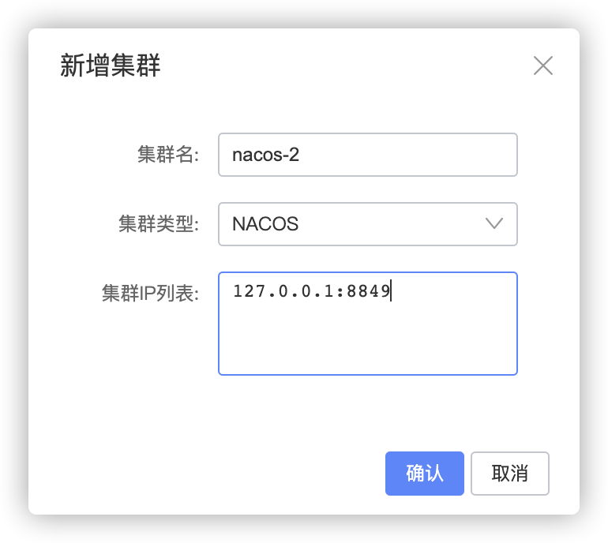
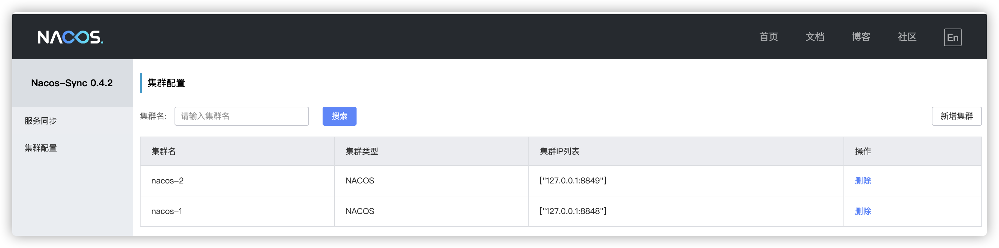
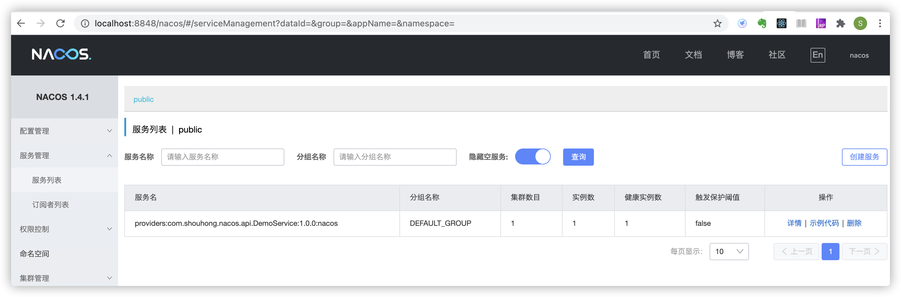
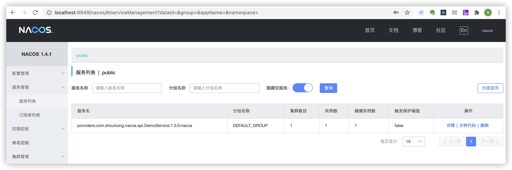
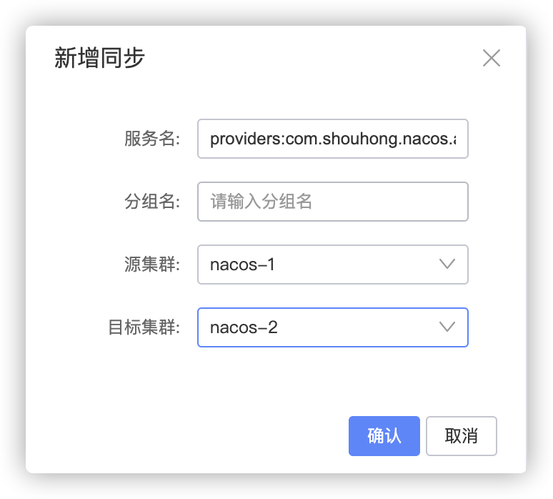
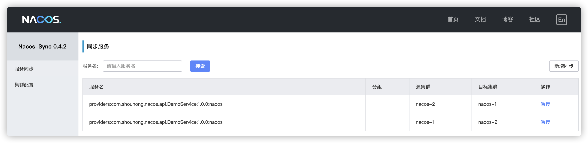
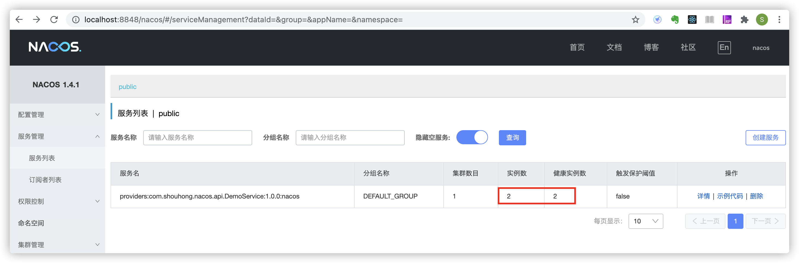
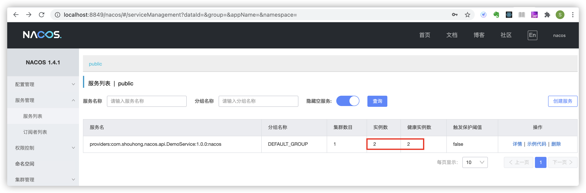

# Nacos Sync 双向同步 Nacos Server 示例

> 本例子包含两个Nacos注册中心互相同步演示

## 环境准备

| 服务       | 版本  |
| ---------- | ----- |
| Nacos-Server | 1.4.1 |
| Mysql      | 5.7   |
| Nacos-Sync | 0.4.4 |
| Dubbo | 2.7.1 |


1. 启动两个 Nacos server

```powershell
$ docker run --name nacos-standalone-1 -e MODE=standalone -p 8848:8848 -d nacos/nacos-server:1.4.1
$ docker run --name nacos-standalone-2 -e MODE=standalone -p 8849:8848 -d nacos/nacos-server:1.4.1
```

2. 启动Mysql

```powershell
$ docker run --name nacos-sync-db -e MYSQL_ROOT_PASSWORD=root -e MYSQL_DATABASE=nacos_sync -p 3306:3306 -d  mysql:5.7
```

3. 启动 Nacos-Sync

   下载最新 Nacos-Sync Release 包,并解压,进入解压后的目录,并修改conf/application.properties中的mysql配置(缺省不用修改)

   ```properties
   server.port=8083
   server.servlet.context-path=/
   
   spring.jpa.properties.hibernate.dialect=org.hibernate.dialect.MySQL5Dialect
   spring.jpa.hibernate.ddl-auto=update
   spring.jpa.properties.hibernate.show_sql=false
   
   
   spring.datasource.url=jdbc:mysql://127.0.0.1:3306/nacos_sync?characterEncoding=utf8
   spring.datasource.username=root
   spring.datasource.password=root
   ```

   执行启动脚本

   ```powershell
   $ ./bin/startup.sh start
   ```

## Nacos Sync 添加集群

打开 Nacos Sync: localhost:8083

## 添加Nacos集群

1. 选择 集群配置->新增集群
   
   


## 添加完成效果



## 注册 Dubbo 服务到 Nacos

### 编译 Dubbo provider 和 consumer 项目
```powershell
$ cd nacos-nacos
$ mvn package
```

### 启动两个 Dubbo provider 实例，分别注册到两个 Nacos Server
```powershell
$ java -Ddubbo.protocol.port=20885 -Ddubbo.registry.address=nacos://127.0.0.1:8848 -jar nacos-provider/target/nacos-provider-1.0-SNAPSHOT.jar
$ java -Ddubbo.protocol.port=20886 -Ddubbo.registry.address=nacos://127.0.0.1:8849 -jar nacos-provider/target/nacos-provider-1.0-SNAPSHOT.jar
```

### 访问 Nacos 控制台，每个 Nacos 服务注册了一个服务实例
1. http://localhost:8848/nacos  (nacos/nacos)


2. http://localhost:8849/nacos  (nacos/nacos)



### 添加同步任务
1. 从 Nacos 控制台查看服务名：providers:com.shouhong.nacos.api.DemoService:1.0.0:nacos

2. 打开 Nacos-Sync 控制台,添加同步任务。

   选择 服务同步 -> 新增同步, 如图
​   
​   

	**注意**：通过Nacos注册的Dubbo服务不需要填写**分组**,因为服务名里面已经包括**分组**和**版本信息**

3. 添加完成效果


4. 查看 Nacos 控制台，两个 Nacos Server 的服务实例数均变成了 2。




### 测试：Dubbo consumer 通过两个 Nacos Server 均可成功调用 provider
```
$ java -Ddubbo.registry.address=nacos://127.0.0.1:8848 -jar nacos-consumer/target/nacos-consumer-1.0-SNAPSHOT.jar
$ java -Ddubbo.registry.address=nacos://127.0.0.1:8849 -jar nacos-consumer/target/nacos-consumer-1.0-SNAPSHOT.jar
```
* 下线一个实例后，通过两个  Nacos Server 仍可成功调用 provider


